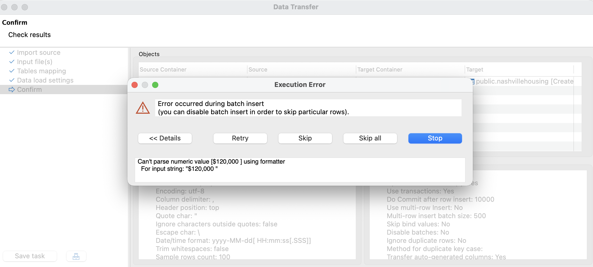
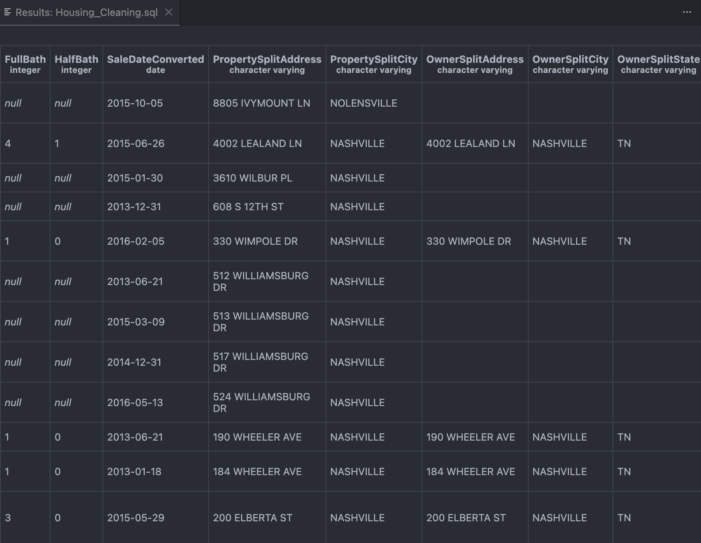

# Data Cleaning Project: Nashville Housing Data 🏠

## 📌 Project Overview
In this project, I took raw, messy housing data and transformed it into a clean, usable format for analysis. The dataset contained common data quality issues including inconsistent date formats, null addresses, mixed-case text, and duplicates.

**Goal:** Create a standardized cleaning pipeline in SQL to prepare the data for visualization.

## ⚠️ The Challenge (Raw Data)
The initial data load was difficult because of format inconsistencies. For example, the `SalePrice` column contained currency symbols (`$120,000`) stored as text, which caused standard import pipelines to fail.

*Figure 1: Resolving data type mismatches during ingestion.*

## 🛠️ The Solution: SQL Cleaning Pipeline
I architected a step-by-step cleaning process using PostgreSQL:

### 1. Standardization
* **Date Formatting:** Converted string dates (`April 9, 2013`) into standard SQL Date objects (`2013-04-09`) using `TO_DATE`.
* **Boolean Logic:** Standardized the "SoldAsVacant" field from `Y/N` to `Yes/No` using `CASE` statements.

### 2. Handling Nulls with Self-Joins
* **Issue:** Property addresses were missing for some rows.
* **Logic:** Since `ParcelID` is constant, I performed a **Self-Join** to populate missing addresses from other rows with the same Parcel ID.

### 3. Advanced Parsing (String Manipulation)
* **Property Address:** Split `Address, City` into two columns using `SUBSTRING` and `STRPOS`.
* **Owner Address:** Parsed `Address, City, State` using the PostgreSQL specific function `SPLIT_PART()`.

### 4. De-Duplication
* Identified 104 duplicate rows using **Window Functions** (`ROW_NUMBER`) partitioned by unique property identifiers.
* Removed duplicates to ensure statistical accuracy.

## 📊 Final Result
The resulting dataset is now normalized and ready for analysis.

*Figure 2: The final clean schema with split columns and standardized dates.*

## 📂 SQL Code
The full cleaning script is available in [Housing_Cleaning.sql](Housing_Cleaning.sql).